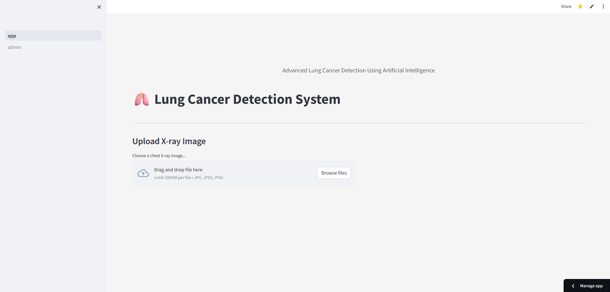

# 🏥 Lung Cancer Information Portal

A comprehensive digital platform designed to empower patients, caregivers, and healthcare providers with accessible lung cancer information and resources.

[](./UI_Preview/UI2.png)
[

## 🌟 Features

### 🤖 Intelligent Navigation Assistant
- Interactive chatbot with modern UI
- Context-aware responses
- Quick access to all portal sections
- User-friendly suggestion chips

### 🧠 AI-Powered Tools
- Lung cancer prediction model
- Risk assessment tools
- Personalized information delivery

### 📚 Comprehensive Resources
- Detailed medical guidelines
- Curated questions for healthcare providers
- Cancer center directory
- External resource links

### 🎯 Key Sections
- **Guidelines**: Medical protocols and best practices
- **Cancer Centers**: Searchable directory of treatment facilities
- **Questions to Ask**: Categorized medical queries
- **Tailored Information**: Personalized content based on user needs

## 🛠️ Technology Stack
- Frontend: HTML, CSS, JavaScript
- AI Integration: Streamlit
- External APIs: Healthcare databases
- UI/UX: Modern, responsive design

## 🚀 Getting Started

### Prerequisites
- Modern web browser
- Internet connection
- JavaScript enabled

### Installation
1. Clone the repository
```bash
git clone https://github.com/yourusername/lung-cancer-portal.git
```
2. Navigate to the project directory
```bash
cd lung-cancer-portal
```
3. Open `index.html` in your browser

## 📱 Usage
1. Access the portal through your web browser
2. Use the chatbot for guided navigation
3. Explore different sections based on your needs
4. Utilize the AI prediction tool for risk assessment
5. Find nearby cancer centers using the directory

## 📄 License
This project is licensed under the MIT License - see the [LICENSE](LICENSE) file for details.

## 🙏 Acknowledgments
- SHUATS
- ICPC (Unite4Cancer)
- MOHFW
- ICMR
- DBT
- DST
- CSIR
- DHR

## 📞 Contact
For any queries or support, please reach out to:
- Email: [shimanshu.3107@gmail.com] for AI/ML - based queries.
- Email: [officialkovid@gmail.com] for Full-stack web development - related queries.

## 🔄 Updates
- Latest update: [May 21, 2025]
- Version: 1.0.0

---

<div align="center">
Made with ❤️ for better healthcare information access
</div> 